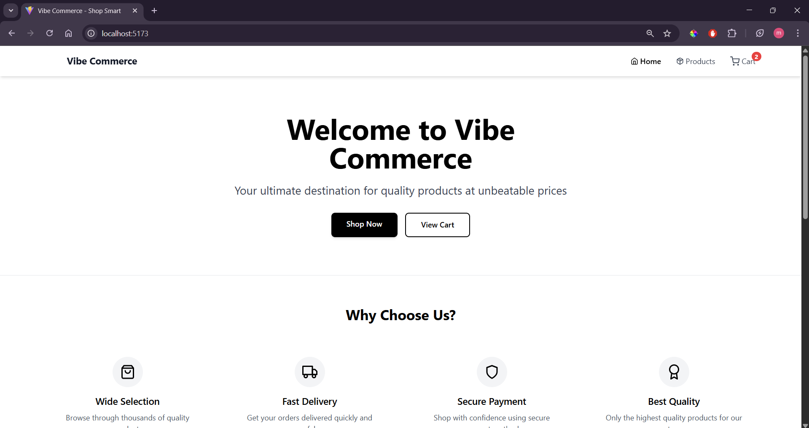
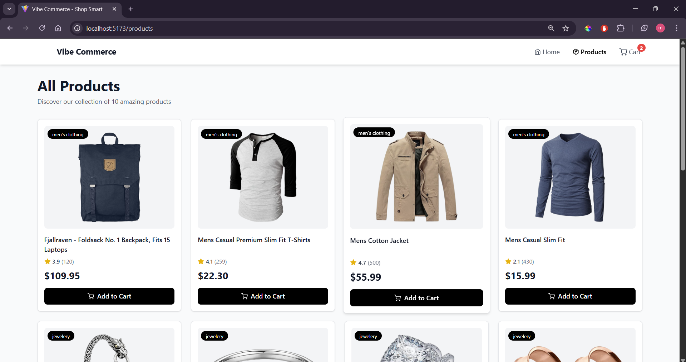
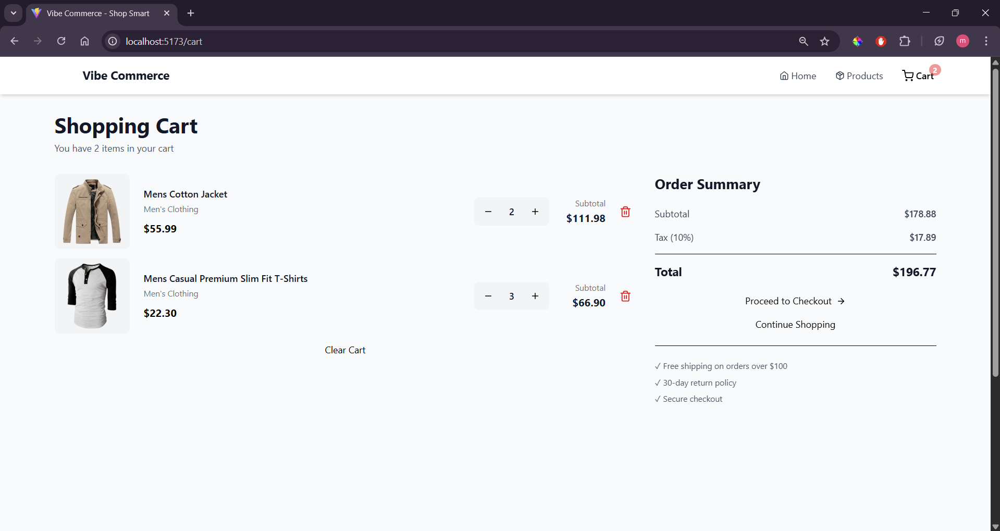
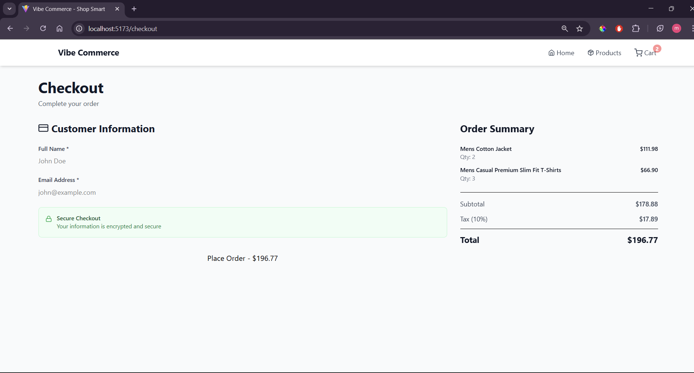

# 🛒 Vibe Commerce — Mock E-Com Cart

> **Nexora Internship Assignment via Internshala**  
> A full-stack MERN shopping cart demonstrating frontend-backend-database integration with Fake Store API for products, session-based cart management, and real-time updates without page refresh.

---

## 📂 Project Structure

```
vibe-commerce/
├── backend/           # Node.js + Express + MongoDB server
│   ├── config/        # Database connection
│   ├── controllers/   # Business logic
│   ├── models/        # Mongoose schemas
│   ├── routes/        # API routes
│   ├── .env          # Environment variables (included)
│   └── server.js     # Entry point
│
├── frontend/          # React client
│   ├── src/
│   │   ├── api/      # API services
│   │   ├── components/ # Reusable components
│   │   ├── pages/    # Route pages
│   │   ├── utils/    # Session manager
│   │   └── App.jsx   # Main component
│   ├── .env          # Environment variables (included)
│   └── vite.config.js # Vite setup
│
└── README.md          # This file
```

---

## 🧰 Tech Stack

| Layer | Technology |
|-------|------------|
| **Frontend** | React 18, Vite, Axios, React Router, TailwindCSS, React Toastify |
| **Backend** | Node.js, Express.js, Mongoose |
| **Database** | MongoDB |
| **External API** | Fake Store API (https://fakestoreapi.com) |
| **Version Control** | Git & GitHub |

---

## ⚙️ Setup Instructions

### Prerequisites
- Node.js v16+ installed
- MongoDB (local or Atlas account)
- Git

### 1️⃣ Clone Repository
```bash
git clone https://github.com/MayurKalwar0251/InternShala_Nexora.git
cd vibe-commerce
```

### 2️⃣ Backend Setup
```bash
cd backend
npm install

# .env file is already included with default values
# For MongoDB Atlas: Edit backend/.env and replace MONGODB_URI

npm run dev
```
✅ **Backend runs on:** http://localhost:5000

### 3️⃣ Frontend Setup (Open new terminal)
```bash
cd frontend
npm install

# .env file is already included, no changes needed

npm run dev
```
✅ **Frontend runs on:** http://localhost:3000

### 4️⃣ Environment Variables

Both `.env` files are **included for easy testing** (no sensitive data):

**backend/.env:**
```env
PORT=5000
MONGODB_URI=mongodb://localhost:27017/vibecommerce
FRONTEND_URL=http://localhost:3000
```

**frontend/.env:**
```env
VITE_API_URL=http://localhost:5000/api
```

---

## 💻 Features

✅ Fetch 10 products from Fake Store API  
✅ Add/Remove/Update cart items with real-time updates  
✅ Display total price dynamically (subtotal + 10% tax)  
✅ Session-based cart (no login required, unique cart per browser)  
✅ Checkout flow with name/email validation  
✅ Generate receipt with order details + timestamp  
✅ MongoDB persistence for cart & receipts  
✅ Responsive design for mobile/desktop  
✅ Toast notifications (no spam)  
✅ Optimistic UI updates (instant feedback, no page refresh)  

---

## 🧠 Bonus Implementations

🎯 **Session-based Cart:** Each user gets unique session ID (stored in localStorage) for separate carts without login  
🎯 **Optimistic UI:** Cart updates instantly before API response (reverts on error)  
🎯 **Real-time Cart Badge:** Navbar cart count updates without refresh using custom events  
🎯 **Error Handling:** Comprehensive try-catch blocks with user-friendly messages  
🎯 **No Page Refresh:** True SPA behavior - all updates happen in-place  
🎯 **Toast Management:** Unique IDs prevent duplicate notifications, max 3 toasts at once  

---

## 📸 Screenshots

### Homepage

*Landing page with hero section, features, and CTA buttons*

### Products Page

*Product grid with live data from Fake Store API*

### Shopping Cart

*Cart management with quantity controls and real-time calculations*

### Checkout & Receipt

*Checkout form and receipt modal with order details*

---

## 🎥 Demo Video

📽️ **Watch the full demo:** [vibe-commerce-demo.mp4](https://youtu.be/7TCnYczfwcY)

**Covers:**
- Product browsing and filtering
- Adding items to cart (real-time updates)
- Cart management (update quantity, remove items)
- Checkout process and receipt generation
- Session-based cart isolation
- Mobile responsiveness

---

## 🧪 API Endpoints

### Products
```
GET  /api/products              → Fetch first 10 products
GET  /api/products/:id          → Get single product
GET  /api/products/category/:c  → Get products by category
```

### Cart
```
GET    /api/cart/:sessionId           → Get cart items + total
POST   /api/cart                      → Add item { productId, qty, sessionId }
PUT    /api/cart/:id                  → Update quantity { qty, sessionId }
DELETE /api/cart/:id                  → Remove item { sessionId }
DELETE /api/cart/clear/:sessionId     → Clear cart
```

### Checkout
```
POST /api/checkout                    → Process order { cartItems, name, email }
GET  /api/checkout/receipts           → Get all receipts
GET  /api/checkout/receipt/:number    → Get single receipt
```

**Example Response (Add to Cart):**
```json
{
  "success": true,
  "message": "Item added to cart successfully",
  "data": {
    "_id": "67890xyz",
    "sessionId": "session_1730123456789_abc",
    "productId": 1,
    "title": "Fjallraven Backpack",
    "price": 109.95,
    "qty": 2,
    "subtotal": 219.90
  }
}
```

---

## 🏗️ Architecture Overview

```
┌─────────────┐         ┌─────────────┐         ┌─────────────┐
│   React     │◄───────►│   Express   │◄───────►│   MongoDB   │
│  Frontend   │  Axios  │   Backend   │ Mongoose│  Database   │
│ (Port 5173) │         │ (Port 5000) │         │             │
└─────────────┘         └──────┬──────┘         └─────────────┘
                               │
                               │ HTTP
                               ▼
                        ┌─────────────┐
                        │ Fake Store  │
                        │     API     │
                        └─────────────┘
```

**Data Flow:**
1. User visits site → Frontend generates unique session ID
2. User adds product → API fetches details from Fake Store API
3. Cart item saved to MongoDB with session ID
4. Cart operations filter by session ID (isolated carts)
5. Checkout creates receipt → Cart cleared → Receipt stored

---

## 🧪 Testing Guide

### Manual Testing
```bash
# Test 1: Different browsers = different carts
Chrome → Add products → See cart
Firefox → Open site → Empty cart (different session)

# Test 2: Session persistence
Add items → Close browser → Reopen → Cart still there

# Test 3: Clear session
Browser console: localStorage.clear()
Refresh page → New session, empty cart
```

### API Testing (Postman/curl)
```bash
# Get products
curl http://localhost:5000/api/products

# Add to cart
curl -X POST http://localhost:5000/api/cart \
  -H "Content-Type: application/json" \
  -d '{"productId":1,"qty":2,"sessionId":"test_123"}'

# Get cart
curl http://localhost:5000/api/cart/test_123
```

---

## ⚠️ Troubleshooting

**Backend won't start:**
- Check MongoDB is running: `mongosh` or `mongo`
- Verify port 5000 is free
- Check .env MONGODB_URI is correct

**Frontend can't connect:**
- Ensure backend is running on port 5000
- Check VITE_API_URL in frontend/.env
- Look for CORS errors in console

**Products not loading:**
- Test Fake Store API: `curl https://fakestoreapi.com/products`
- Check internet connection
- See Network tab in browser DevTools

---

## 🧑‍💻 Author & Credits

**Developed by:** Mayur Kalwar  
**For:** Nexora Internship Assignment via Internshala  
**Date:** October 2025  
**GitHub:** [github.com/MayurKalwar0251](https://github.com/MayurKalwar0251)

---

## 📝 Assignment Completion Checklist

### Required Features
- ✅ Fetch products from Fake Store API
- ✅ Add items to cart (POST /api/cart)
- ✅ Display cart with total (GET /api/cart)
- ✅ Remove items (DELETE /api/cart/:id)
- ✅ Checkout with name/email (POST /api/checkout)
- ✅ Generate receipt with timestamp
- ✅ MongoDB persistence
- ✅ Error handling
- ✅ Loading states
- ✅ Responsive UI (TailwindCSS)

### Bonus Features
- ✅ Session-based cart (no login)
- ✅ Real-time updates (no page refresh)
- ✅ Optimistic UI
- ✅ Toast notifications
- ✅ Form validation
- ✅ Receipt modal
- ✅ Clean code structure

---

## 📄 License

This project is created for educational purposes as part of an internship assignment.

---

**🚀 Ready to Test?**
1. Clone repo
2. Install dependencies (backend + frontend)
3. Start both servers
4. Open http://localhost:5173
5. Start shopping!

For any issues, check the Troubleshooting section or API documentation above.
